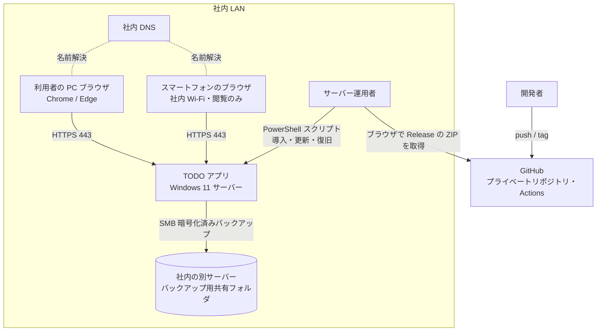
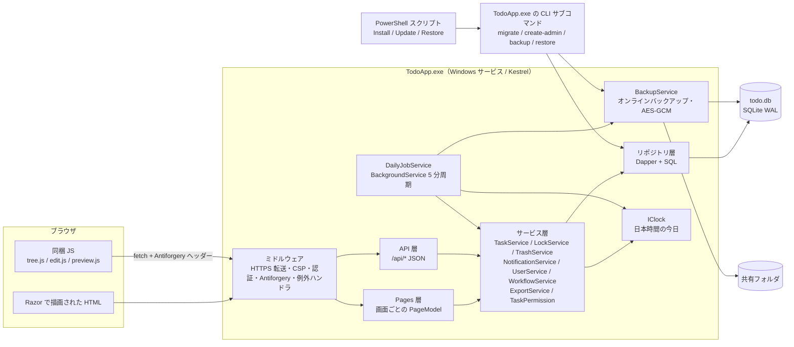
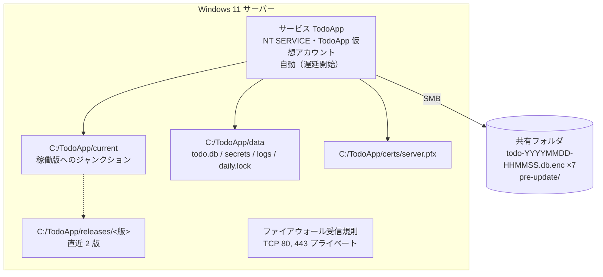
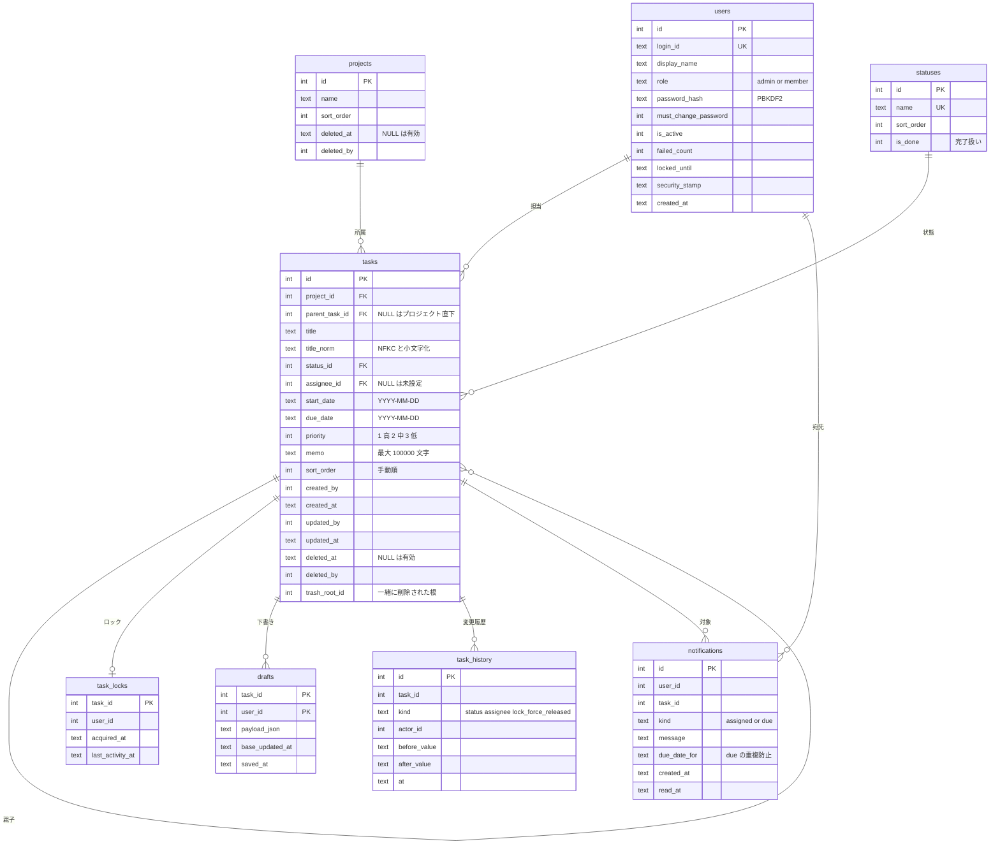

# アーキテクチャ設計書

入力: [requirements.md](../01-requirements/requirements.md)（US-001〜US-022・FR-001〜FR-008）、[nfr.md](../01-requirements/nfr.md)（NFR-001〜NFR-015）、[environment.md](../01-requirements/environment.md)、[glossary.md](../01-requirements/glossary.md)。
既存コード: なし（新規開発。リポジトリにはハーネスと docs だけがある。2026-09-26 に確認）。

## 1. 技術スタック

| 領域 | 選定技術 | 選定理由（詳細は ADR 参照） |
|---|---|---|
| フロントエンド | ASP.NET Core Razor Pages のサーバー側描画＋同梱の素の JavaScript（ES Modules。ビルド工程なし）と CSS。外部 CDN は使わない | 画面の大半は表示が主（主用途は「見る」）。対話部分（ツリー展開・自動保存・プレビュー）だけ JS で補う（[ADR 0001](adr/0001-tech-stack-dotnet.md)） |
| バックエンド | .NET 10（LTS）/ ASP.NET Core（Kestrel 直接待ち受け）。Markdown は Markdig、パスワードは `PasswordHasher<T>`（PBKDF2） | Windows サービスへの標準対応と、前提ソフト不要の self-contained 配布（[ADR 0001](adr/0001-tech-stack-dotnet.md)・[ADR 0003](adr/0003-auth-cookie-pbkdf2.md)） |
| データストア | SQLite（WAL）＋ Microsoft.Data.Sqlite ＋ Dapper。スキーマ変更は番号付きの素の SQL ファイル | アプリ同梱型（Q-06-4）。承認した SQL をそのまま適用できる（Q-09-9）。利用中の一貫したバックアップ（[ADR 0002](adr/0002-sqlite-plain-sql-migrations.md)） |
| インフラ/ホスティング | 社内の Windows 11 サーバー 1 台。Windows サービス `TodoApp`（仮想アカウント）。HTTPS は社内ルート CA で発行したサーバー証明書。導入・更新・復旧は PowerShell 5.1 スクリプト | environment.md。IIS を使わず Windows 11 の接続数制限を避ける（[ADR 0006](adr/0006-distribution-service-update-tls.md)） |
| CI/CD | GitHub Actions。push・PR は Ubuntu でビルド・テスト・gitleaks。タグ `v*` だけ Windows でパッケージ化と Pester テスト、Release へ ZIP＋SHA-256。CD はなし（人がサーバーで更新スクリプトを実行） | 月 0 円・Windows ランナーの消費最小化（A-024。[ADR 0006](adr/0006-distribution-service-update-tls.md)） |
| テスト | xUnit（単体・結合。結合は実 SQLite の一時ファイル）、`WebApplicationFactory` による HTTP 結合テスト、Playwright for .NET（E2E。Chrome/Edge）、Pester（PowerShell スクリプト） | 実装フェーズで test-plan.md に対応づける |

対応する ADR: [adr/](adr/)（0001 技術スタック / 0002 データストアとマイグレーション / 0003 認証と Web セキュリティ / 0004 編集ロックと下書き / 0005 日次処理とバックアップ / 0006 配布・サービス・更新・TLS）
前提となる環境情報: [environment.md](../01-requirements/environment.md)

## 2. システムコンテキスト図

アプリから社外への送信は無い（NFR-006 (4)・FR-008）。GitHub との通信は人がブラウザで配布物を取得するときだけで、アプリ自身は行わない。

## 3. コンポーネント構成図

- 依存の向きは Pages/API → サービス → リポジトリの一方向。**認可（requirements.md §5.0 の権限表）はサービス層の `TaskPermission` だけで判定する**（画面のボタンの無効化は表示用。FR-001）。
- 日付の判定（期限超過・通知・日次処理・ゴミ箱の 30 日）は必ず `IClock` を通す。`IClock` はサーバーの OS 設定によらず `Tokyo Standard Time` の暦日を返す（US-013「サーバーのタイムゾーン（日本時間）」）。テストでは時刻を差し替える。
- スクリプトは DB を直接触らず、`TodoApp.exe` の CLI サブコマンド（同じリポジトリ層・同じ SQL）を呼ぶ。スキーマ変更・暗号化の実装を 1 か所に保つため。

### 3.1 配置図（サーバー）

## 4. データモデル概要

補助テーブル: `schema_version(version, applied_at)`、`daily_runs(run_date PK, completed_at)`、`backup_runs(id, run_date, started_at, finished_at, ok, error_id, file_name)`。

- 日時は UTC の ISO 8601 文字列で保存し、表示時に日本時間の `YYYY/MM/DD`（NFR-015）に変換する。開始日・期限は時刻を持たない暦日文字列。
- **ゴミ箱**: タスクを削除すると、そのタスクと全子孫に同じ `deleted_at`・`deleted_by`・`trash_root_id`（削除操作の根のタスク ID）を付ける。ゴミ箱画面は `trash_root_id = id` の行（根）だけを並べ、復元は同じ `trash_root_id` を持つ行をまとめて戻す（US-008）。プロジェクトの削除は `projects.deleted_at` だけを付け、配下は「プロジェクトが削除済み」として一覧から外す（管理者だけが戻せる）。
- **期限の通知の重複防止**: `notifications` に `UNIQUE(user_id, task_id, kind, due_date_for)`（`kind='due'` のとき）。「明日です」と「今日です」は同じ `due_date_for` なので当日に重ねて出ない。期限を変えれば `due_date_for` が変わるので新しい期限で再び通知される（US-016）。
- 主な索引: `tasks(parent_task_id)`・`tasks(project_id)`・`tasks(assignee_id)`・`tasks(due_date)`・`tasks(deleted_at)`・`notifications(user_id, read_at)`。

## 5. API / インターフェース概要

画面（Razor Pages。すべて要ログイン。管理画面は管理者ロール）:

| エンドポイント/インターフェース | 概要 | 認証要否 |
|---|---|---|
| `GET/POST /login`・`POST /logout` | ログイン・ログアウト（ログアウトで本人のロックを解放） | 不要 / 要 |
| `GET/POST /account/password` | パスワード変更（初期パスワードのままなら他の画面からここへ強制転送） | 要 |
| `GET /`（`/tasks`） | タスク一覧（階層ツリー）。クエリで絞り込み・並び順・「完了も表示」・「自分の担当だけ」 | 要 |
| `GET /tasks/{id}` | タスク詳細（項目・メモのプレビュー・変更履歴・ロック状態） | 要 |
| `POST /projects/{id}/tasks`・`POST /tasks/{id}/children` | タスクの新規作成 | 要 |
| `POST /tasks/{id}/save`・`/move`・`/reorder`・`/delete` | 保存（ロック必須）・移動・上へ/下へ・削除 | 要（編集権限） |
| `GET /calendar?view=month or week&date=` | カレンダー（一覧と同じ絞り込みクエリを引き継ぐ） | 要 |
| `GET /notifications`・`POST /notifications/{id}/open` | 通知一覧・既読にして対象へ遷移 | 要 |
| `GET /trash`・`POST /trash/{rootId}/restore` | ゴミ箱・復元 | 要 |
| `GET /export.csv` | 現在の絞り込み条件の CSV（UTF-8 BOM） | 要 |
| `/admin/users`・`/admin/workflow`・`/admin/projects`・`/admin/system` | 利用者・状態・プロジェクトの管理、バックアップ状況 | 要（管理者） |

JSON API（画面の JS から `fetch`。状態変更は Antiforgery トークン必須）:

| エンドポイント/インターフェース | 概要 | 認証要否 |
|---|---|---|
| `GET /api/tasks/{id}/children?<絞り込み>` | 折りたたまれた行の子を部分 HTML で返す | 要 |
| `POST /api/tasks/{id}/lock` | ロック取得（競合時 409 と保持者名・取得時刻）。下書きがあれば下書きと衝突有無を返す | 要（編集権限） |
| `DELETE /api/tasks/{id}/lock` | キャンセル（ロックと下書きを消す） | 要 |
| `POST /api/tasks/{id}/lock/force-release` | 強制解除 | 要（管理者） |
| `PUT /api/tasks/{id}/draft` | 自動保存（60 秒ごと・変更時のみ） | 要（ロック保持者） |
| `POST /api/markdown/preview` | 編集中のメモのプレビュー HTML | 要 |
| `GET /healthz` | 起動確認（DB に接続でき、スキーマの版が一致すれば 200） | 不要（ループバックからのみ受け付ける） |

CLI（`TodoApp.exe <サブコマンド>`。スクリプトから呼ぶ。サービスとは別プロセスで、サービス停止中に使う）:

| エンドポイント/インターフェース | 概要 | 認証要否 |
|---|---|---|
| `migrate --init` / `--plan` / `--apply` | DB 作成と初期データ / 未適用 SQL の表示 / 適用（1 ファイル 1 トランザクション） | サーバーの管理者権限 |
| `create-admin` | 管理者利用者の作成（パスワードは標準入力） | 同上 |
| `backup --to <dir>` / `restore --from <file> [--key-stdin]` / `list-backups` | 手動バックアップ（更新前）・復旧・世代一覧 | 同上 |

エラーは `E-<領域>-<内容>` の ID（例: `E-AUTH-LOCKED`・`E-LOCK-HELD`・`E-LOCK-LOST`・`E-PERM-DENIED`・`E-TASK-CYCLE`・`E-DB-BUSY`）で返し、画面に文言と ID を出す。全一覧と文言は詳細設計（`/04-design-detailed`）で定義する。

## 6. 非機能要件の実現方法

| NFR ID | NFR項目 | 実現方法 |
|---|---|---|
| NFR-001 | 性能（一覧 1 秒・保存 500ms） | 一覧は削除されていないタスクの軽量列（メモを除く）を 1 回の SQL で読み、メモリ上でツリーを組んで絞り込む（15,000 件で数十 ms）。HTML は展開済みの行（既定 3 段目まで・絞り込みの該当行と祖先）だけ描画し、折りたたまれた子は `/api/tasks/{id}/children` で遅延取得する。保存は単一行の更新＋履歴で、SQLite WAL の単一ライターで数 ms。テストフェーズで 15,000 件・同時 10 人の負荷で実測する |
| NFR-002 | 同時アクセス数 | Kestrel 直接待ち受け（IIS の接続数制限を受けない。ADR 0006）。30 人規模でも SQLite の読み取りは並行、書き込みは直列で十分 |
| NFR-003 | 可用性（平日日中） | Windows サービスの自動（遅延）起動と回復設定（ADR 0006）。日次処理は起動・復帰・日付変更を 5 分周期で検知（ADR 0005）。更新の計画停止は更新スクリプトで 30 分以内（停止〜`/healthz` 確認） |
| NFR-004 | RTO/RPO | 毎日のバックアップ（ADR 0005）と復旧スクリプト。機材喪失は新サーバーで `Install-TodoApp.ps1` → `Restore-TodoApp.ps1`（控えの鍵を入力） |
| NFR-005 | 認証・認可 | Cookie 認証・PBKDF2・5 回失敗で 15 分・8 時間スライディング・初回変更の強制・`security_stamp` による即時失効。認可はサービス層の `TaskPermission` で全 API に適用（ADR 0003）。暫定値は `appsettings.json` |
| NFR-006 | データ保護 | HTTPS（80→443 転送）。`data` フォルダの ACL を実行アカウントと Administrators に限定。バックアップは AES-256-GCM（ADR 0005）。外部 CDN・解析タグ・外部 API を使わない（CSP `default-src 'self'` で機械的にも防ぐ）。CSV はログイン済みのみ |
| NFR-007 | OWASP Top 10 相当 | XSS: Razor の自動エスケープ・Markdig `DisableHtml`・リンクのスキーム制限・CSP。CSRF: Antiforgery を全 POST/PUT/DELETE に必須。SQL インジェクション: Dapper のパラメータ化のみ（文字列連結の SQL を禁止し、レビュー観点にする）。認可: サーバー側判定。CSV インジェクション: 先頭が `=` `+` `-` `@` タブ・CR のセルに `'` を前置。セッション固定: ログイン時に Cookie を再発行。リリース前に `release-security-review` |
| NFR-008 | ログ | Serilog でファイル出力（`data/logs/app-YYYYMMDD.log`。日次処理で 90 日超を削除）。起動失敗は Windows イベントログにも書く。パスワード・Cookie・セッション ID・鍵はログに出さない（出力前のマスク）。業務の変更履歴は `task_history`（削除しない） |
| NFR-009 | バックアップ | ADR 0005。更新前バックアップは `pre-update/`（世代に数えない） |
| NFR-010 | データ量 | 15,000 件・30 人を設計目安（ADR 0002）。メモは 100,000 文字で拒否（FR-005） |
| NFR-011 | 対応環境 | Chrome・Edge 最新版で E2E。レスポンシブ CSS（幅 768px 未満は一覧を 1 列表示・編集ボタンを出さない閲覧専用レイアウト） |
| NFR-012 | コスト | 有料サービスを使わない。GitHub Actions の Windows ランナーはタグ時のみ |
| NFR-013 | コンプライアンス | データは社内サーバーと社内共有フォルダだけに置く。個人情報は表示名とログイン ID のみ |
| NFR-014 | アクセシビリティ | `<label>` の関連付け、コントラスト 4.5:1 以上の配色トークン、期限超過・期限間近は色＋アイコン＋文字（「期限超過」「期限間近」） |
| NFR-015 | 国際化 | 日本語のみ。表示は `IClock` 経由の日本時間 `YYYY/MM/DD` |

## 7. 要件対応表（トレーサビリティ）

| 要件ID | 対応する設計要素 |
|---|---|
| US-001 | `/login`・Cookie 認証・ロックアウト・8 時間失効・未ログイン時の転送（ADR 0003） |
| US-002 | `/account/password`・`must_change_password` による強制転送 |
| US-003 | `/admin/users`・`UserService`（最後の管理者の保護・無効化時の担当者表示「（無効）表示名」）・`security_stamp` |
| US-004 | `tasks`/`projects` テーブル・`TaskService.Create`・`/admin/projects`・作成者/更新者の自動記録 |
| US-005 | 一覧（メモリ上のツリー組み立て・既定 3 段展開・`/api/tasks/{id}/children`）・「完了も表示」・完了の親を薄く表示 |
| US-006 | `/tasks/{id}/save`（ロック必須）・未完了の子の警告（保存前の確認ダイアログ） |
| US-007 | `/tasks/{id}/move`（循環の検出は再帰 CTE で子孫を列挙）・`/reorder`（`sort_order`）・配下のロックと編集権限の検査 |
| US-008 | 削除（`trash_root_id`）・`/trash`・復元・日次処理の完全削除（30 日） |
| US-009 | Markdig（`DisableHtml`・タスクリスト・取り消し線・表は無効）・`task:<ID>` リンク・`/api/markdown/preview`・チェックボックスは表示専用（`disabled`） |
| US-010 | `task_locks`・`drafts`・自動保存（ADR 0004） |
| US-011 | `/api/tasks/{id}/lock/force-release`・`task_history`（`lock_force_released`） |
| US-012 | 一覧の絞り込み（担当者・状態・期限範囲・自分の担当だけ）・`title_norm` による検索・並び順（期限昇順 / 手動順）・カレンダーへのクエリ引き継ぎ・（Could）メモ本文の検索 |
| US-013 | `IClock` による期限超過・期限間近の判定・色＋アイコン＋文字・「期限超過 n 件」（§9） |
| US-014 | `/calendar`（月・週。帯と点。1 日 3 件で「他 n 件」。閲覧専用） |
| US-015 | `statuses`・`/admin/workflow`・`WorkflowService`（使用中の削除拒否・完了扱い 1 つ以上）・初期データ（`migrate --init`） |
| US-016 | `notifications`・担当設定時の通知・日次処理の期限の通知（A-020 (a)・重複防止の一意制約）・ヘッダーの未読件数 |
| US-017 | `task_history`・詳細画面の変更履歴 |
| US-018 | `/export.csv`（UTF-8 BOM・RFC 4180 エスケープ・CSV インジェクション対策・（Could）メモ列） |
| US-019 | `Install-TodoApp.ps1`・Windows サービス・`DailyJobService`（ADR 0005・0006） |
| US-020 | `BackupService`・`backup_runs`・管理画面の状況表示と 3 稼働日の警告・`Restore-TodoApp.ps1`（ADR 0005・0006） |
| US-021 | （Could）一覧とカレンダーのドラッグ＆ドロップ。移動は US-007 と同じ `/move`、日付変更は `/save` と同じ検証とロック確認を経る専用 API を後から足す |
| US-022 | `Update-TodoApp.ps1`・`migrate --plan/--apply`・`current` ジャンクションの切り替えと自動ロールバック（ADR 0002・0006） |
| FR-001 | `TaskPermission`（サービス層で全 API に適用）・画面のボタン無効化 |
| FR-002 | `TaskService` の日付検証（期限 < 開始日を拒否） |
| FR-003 | 親の値を子から計算する処理を持たない（`tasks` の各行が独立に値を持つ） |
| FR-004 | 完全削除は `DailyJobService` の 30 日判定だけ。利用者向けの完全削除 API を作らない |
| FR-005 | メモ 100,000 文字の検証（サーバー側。フォームにも `maxlength`） |
| FR-006 | カレンダーに書き込み系の操作を置かない |
| FR-007 | 状態の変更に遷移の制約を設けない（`statuses` は並びと完了扱いだけを持つ） |
| FR-008 | 外部送信の実装を持たない・CSP `connect-src 'self'` |
| NFR-001 | §6 NFR-001 |
| NFR-002 | §6 NFR-002 |
| NFR-003 | §6 NFR-003 |
| NFR-004 | §6 NFR-004 |
| NFR-005 | §6 NFR-005・ADR 0003 |
| NFR-006 | §6 NFR-006・ADR 0005・0006 |
| NFR-007 | §6 NFR-007・ADR 0003 |
| NFR-008 | §6 NFR-008 |
| NFR-009 | §6 NFR-009・ADR 0005 |
| NFR-010 | §6 NFR-010 |
| NFR-011 | §6 NFR-011 |
| NFR-012 | §6 NFR-012 |
| NFR-013 | §6 NFR-013 |
| NFR-014 | §6 NFR-014 |
| NFR-015 | §6 NFR-015 |

要件ID は requirements.md の `US-/FR-nnn` と nfr.md の `NFR-nnn`（ID 体系は `docs/00-overview/README.md`。
`tools/trace-check.py` が orphan / dangling を検査する）。

## 8. 詳細設計

コンポーネント/画面/API単位の詳細設計は [detailed-design/](detailed-design/README.md)（DD-01〜DD-12。要件との対応表は README）。画面のモックアップは [ui/](ui/)（`design-tokens.md`・`screen-00-states.html`〜`screen-03-calendar.html`。ユーザーの確認を設計ゲートの前提にする）。実装規約は `.github/skills/dotnet-conventions/SKILL.md`。

詳細設計で追加した決定（本書の記述を補う）: `backup_runs.kind`（日次と更新前を区別）、Install の復旧モード `-Recover`、一覧の描画行数の上限 3,000 行（超えると展開する段を減らす）、CLI の `has-admin`・`import-key`・`check-schema`。

## 9. 要件で「設計で決定」とされた事項の決定（requirements.md §5.13）

| 事項 | 決定 | 関連 |
|---|---|---|
| キーワード検索の大文字・小文字、全角・半角 | 区別しない。検索語とタイトルの両方を NFKC 正規化＋小文字化して部分一致（`title_norm`）。ひらがなとカタカナは区別する | US-012 |
| 「期限超過 n 件」の数え方 | **現在の絞り込み条件に関係なく全タスク（ゴミ箱と完了扱いを除く）で数える**。リーダーが朝に全体の遅れを見落とさないため（P1）。クリックすると他の条件を外して「期限超過」だけの絞り込みにする | US-013 |
| カレンダーの 1 日の表示件数の閾値 | 月表示は 1 日 3 件まで表示し、4 件目以降は「他 n 件」。週表示は全件表示 | US-014 |
| 起動中のバックアップで整合を取る方式 | SQLite オンラインバックアップ API（ADR 0005） | US-020 |
| Windows のサービス登録の方法 | `sc.exe` で登録。仮想アカウント `NT SERVICE\TodoApp`・自動（遅延開始）・回復設定（ADR 0006） | US-019 |
| パスワードのハッシュ方式、CSRF・XSS 等の具体策 | ADR 0003・§6 NFR-007 | NFR-005・NFR-007 |
| 自己署名証明書の有効期間 | 社内ルート CA 10 年（端末に 1 回だけ信頼設定）、サーバー証明書 397 日（SAN にホスト名と IP）。補助スクリプト `New-TodoAppCertificate.ps1` を人が実行する（ADR 0006） | environment.md |
| 起動時のバックアップが失敗したときの再試行の間隔 | 当日中 30 分ごと（ADR 0005） | US-020 |
| 前提ソフトと依存パッケージの一覧 | 前提ソフト（人が用意）: Windows 11・Windows PowerShell 5.1（OS 標準）・管理者権限のアカウント・証明書 PFX。依存パッケージ（Markdig・Dapper・Microsoft.Data.Sqlite・Serilog 等）は CI のビルドで配布物に同梱し、サーバーでは取得しない（ADR 0001） | US-019 |

その他の設計判断:

- タスクへのリンクの書き方: `[表示名](task:123)`。詳細画面にタスク ID（`#123`）とリンク記法のコピーボタンを置く。削除済み（ゴミ箱・完全削除）のリンク先は「（削除されたタスク）」と表示し、リンクにしない（US-009）。
- 一般利用者に見せない操作は、ボタンを無効表示にしたうえで理由（FR-001 の文言）を添える。強制解除ボタンは一般利用者には表示しない（US-011）。

## 10. リスクと未確認の前提（設計への影響）

| ID | 内容 | 設計での扱い |
|---|---|---|
| A-017 | Secret scanning / CodeQL が無料で使えない可能性 | CI の必須ジョブに gitleaks を入れる。静的解析は .NET の組み込みアナライザー（`AnalysisLevel=latest-recommended`・警告をエラー扱い）で代替。最初の push の前に人が確認する |
| A-022 | 退避先サーバーの稼働時間が未確認 | 当日中 30 分ごとの再試行と 3 稼働日連続失敗の警告で吸収する。退避先が日中も止まっている場合は吸収できないため、リリース前に人が確認する |
| A-023 | Windows 11 のエディション・ファイアウォール・同時接続数 | Kestrel 直接待ち受けで IIS の制限を避け、ファイアウォール規則はセットアップスクリプトが作る。ネットワークプロファイル（プライベート）と使用許諾条項の確認は人手のまま。リリース前に人が確認する |
| 開発環境 | 開発機に .NET 10 SDK が未導入（2026-09-26 時点で `dotnet` コマンドが見つからない） | 実装フェーズの最初のタスクで導入を確認する（人の導入作業が必要なら、その時点で止まって依頼する） |
