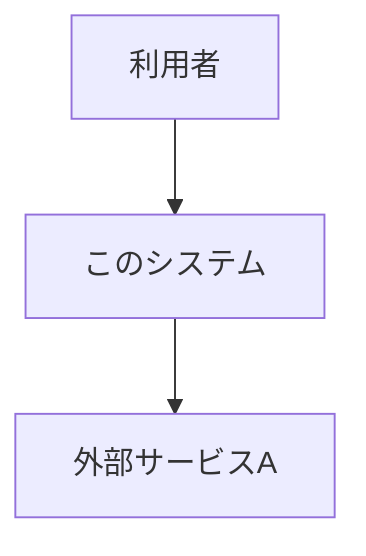

# アーキテクチャ設計書

## 1. 技術スタック

| 領域 | 選定技術 | 選定理由（詳細は ADR 参照） |
|---|---|---|
| フロントエンド | | |
| バックエンド | | |
| データストア | | |
| インフラ/ホスティング | | |
| CI/CD | | |

対応する ADR: [adr/](adr/)
前提となる環境情報: [environment.md](../01-requirements/environment.md)

## 2. システムコンテキスト図

## 3. コンポーネント構成図

## 4. データモデル概要

（該当する場合はER図。Mermaid の `erDiagram` を使用）

## 5. API / インターフェース概要

| エンドポイント/インターフェース | 概要 | 認証要否 |
|---|---|---|
| | | |

## 6. 非機能要件の実現方法

| NFR ID | NFR項目 | 実現方法 |
|---|---|---|
| NFR-xxx | 性能 | |
| NFR-xxx | 可用性 | |
| NFR-xxx | セキュリティ | |
| NFR-xxx | 監視・ログ | |

## 7. 要件対応表（トレーサビリティ）

| 要件ID | 対応する設計要素 |
|---|---|
| US-001 | |
| NFR-001 | |

要件ID は requirements.md の `US-/FR-nnn` と nfr.md の `NFR-nnn`（ID 体系は `docs/00-overview/README.md`。
`tools/trace-check.py` が orphan / dangling を検査する）。

## 8. 詳細設計

コンポーネント/画面/API単位の詳細設計は [detailed-design/](detailed-design/) を参照。
