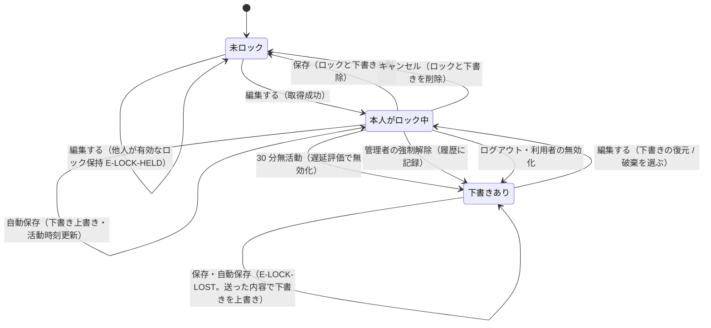

# DD-05 編集ロック・自動保存・下書き

方針は [ADR 0004](../adr/0004-edit-lock-and-draft.md)。

## 1. 用語と判定

- **有効なロック**: `task_locks` の行で `now - last_activity_at < 30 分`。ちょうど 30 分で無効（US-010 の境界: 29 分 59 秒は有効）。
- **活動**: サーバーが自動保存（`PUT /api/tasks/{id}/draft`）を受け取ったとき、および取得時。画面を開いているだけ・プレビュー要求は活動に数えない。
- 下書きのキーは `(task_id, user_id)`。本人以外には見せない。

## 2. 状態遷移



「下書きあり」は本人の視点の状態で、タスク自体は未ロック（他人は取得できる）。

## 3. API

### `POST /api/tasks/{id}/lock`（取得。US-010）

```
（BEGIN IMMEDIATE）
 1. task が有効（無ければ E-TASK-NOT-FOUND）。EnsureEdit
 2. DELETE FROM task_locks WHERE task_id = :id AND last_activity_at <= now - 30分
 3. 既存行がある:
      本人 → 取得済みとして扱い、last_activity_at を更新（別タブで再度押した場合）
      他人 → 409 E-LOCK-HELD { holder, since(acquired_at) }
 4. INSERT task_locks(task_id, user_id, acquired_at=now, last_activity_at=now)
 5. 本人の下書きがあれば draft を返す
→ 200 {
    task: { 現在の全項目, updatedAt },
    draft: null | { payload, savedAt, conflict: null | { updatedBy: "表示名", updatedAt } }
  }
```

- `conflict` は `drafts.base_updated_at <> tasks.updated_at` のとき（下書き作成後に誰かが保存した）。
- 2 人が同時に押した場合、`BEGIN IMMEDIATE` で直列化され、後の人は手順 3 で他人の行を見て 409 になる（主キー制約でも二重取得は起きない）。

### 下書きの復元・破棄（画面の動き）

- 下書きがあれば「保存されていない下書きがあります（HH:MM）」ダイアログで【下書きを復元】【破棄して最新の内容で編集】を選ばせる。
- `conflict` があれば同じダイアログに「下書き作成後に ◯◯さんが更新しています（YYYY/MM/DD HH:mm）」と出し、【下書きの内容で編集を続ける】【最新の内容で編集（下書きを破棄）】の 2 択にする（どちらの内容で保存するかを本人が選ぶ。US-010）。
- 破棄は `DELETE /api/tasks/{id}/draft`（本人の下書きだけ消す。ロックは保持）。
- 復元を選んだ場合、編集欄を下書きの値で埋め、`baseUpdatedAt` は**現在の** `tasks.updated_at` にする（再度の衝突表示を繰り返さないため）。
- 下書きの状態が削除済み、または担当者が無効化されている場合は、その項目だけ現在のタスクの値に置き換え、「下書きの状態（担当者）は使えなくなったため、現在の値にしました」と編集欄の上に注記する（保存時の `E-VALIDATION` を避ける）。

### `PUT /api/tasks/{id}/draft`（自動保存）

- 本文: §DD-04 §2 の項目＋`baseUpdatedAt`。検証は長さ・形式だけ（タイトル空などの業務検証はしない。書きかけを残すため）。メモが上限を超えていれば 400 `E-MEMO-TOO-LONG`（下書きにも上限を適用）。
- 有効なロックが本人のもの → `drafts` を UPSERT、`last_activity_at = now` → 204。
- そうでない → `drafts` だけ UPSERT し、**コミットしてから** 409 `E-LOCK-LOST`（DD-01 §5 の結果型。画面は編集欄を読み取り専用にし、「ロックが解除されています。内容は下書きとして残りました」を出す）。
- JS（`edit.js`）: 入力イベントで dirty フラグを立て、`Lock:AutosaveSeconds`（60 秒）ごとに dirty なら送って dirty を下ろす。`beforeunload` では送らない（タブを閉じた場合は最後の自動保存が下書きになる。US-010）。

### `DELETE /api/tasks/{id}/lock`（キャンセル）

本人の有効なロックと本人の下書きを削除 → 204。ロックが既に無ければ下書きだけ削除して 204。

### 保存 `POST /tasks/{id}/save`

DD-04 §4。ロックが本人のものでなければ、送られた内容で下書きを UPSERT（`base_updated_at` は送られた `baseUpdatedAt`）してコミットし、409 `E-LOCK-LOST`。権限の判定より先に行う。

**結合テストの観点**: 自動保存・保存の 409 `E-LOCK-LOST` の後、`drafts` に送信した内容が残っていること（強制解除の後に担当者が付け替えられた場合も）。

## 4. 解放の契機

| 契機 | ロック | 下書き |
|---|---|---|
| 保存成功・キャンセル | 削除 | 削除 |
| 30 分無活動 | 次の取得時・日次処理で行を削除（それまでは無効として扱う） | 残る |
| 強制解除 | 削除 | 残る |
| ログアウト | 本人の全行を削除 | 残る |
| 利用者の無効化 | 本人の全行を削除 | 残る |
| タスクの削除（本人） | 削除 | 残る（完全削除で消える） |
| タブを閉じる | 30 分まで保持 | 最後の自動保存が残る |

## 5. 詳細画面での表示

- 他人の有効なロックがある: 「山田 花子さんが編集中（10:42 から）」の帯。「編集する」は無効。管理者には「ロックを強制解除」ボタン。
- 本人の有効なロックがある（別タブ等）: 「あなたが編集中です」と「編集を再開する」（取得 API を呼んで再開）。
- 表示はページを開いた時点の判定（ADR 0004）。

## 6. 強制解除（US-011）

`POST /api/tasks/{id}/lock/force-release`（管理者のみ。一般利用者は 403 `E-PERM-ADMIN-ONLY`、ボタン自体を出さない）。

```
（BEGIN IMMEDIATE）
 1. 有効なロックが無い → 200（何もしない。画面には「ロックは既に解除されています」）
 2. 行を削除
 3. task_history(kind='lock_force_released', actor=管理者, before_value=元の保持者の表示名, after_value=NULL, at=now)
 4. ログに記録
```

元の保持者の下書きは消さない。元の保持者が次に自動保存・保存すると `E-LOCK-LOST` になる。
